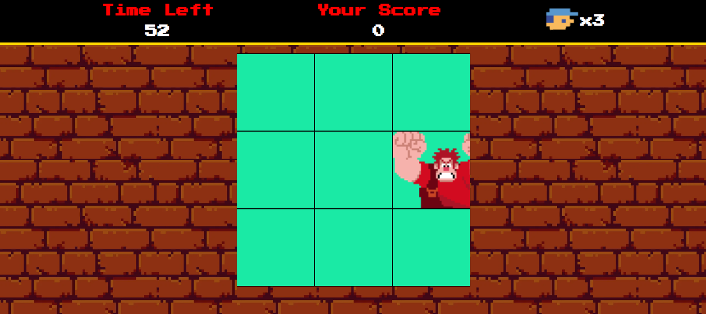

<h1 align="center">JSGame Detona Ralph</h1>

Bem-vindo ao **JSGame Detona Ralph**! Neste repositório, você encontrará um jogo divertido baseado no famoso filme "Detona Ralph". Este projeto não apenas oferece entretenimento, mas também demonstra várias técnicas avançadas de desenvolvimento de jogos em JavaScript.

  <a href="https://gabcostta.github.io/jsgame-detona-ralph/" style="display: inline-block; padding: 10px 20px; font-size: 18px; font-weight: bold; text-align: center; text-decoration: none; background-color: #4CAF50; color: #ffffff; border-radius: 6px; border: 2px solid #4CAF50;">
    Clique aqui para acessar o jogo!
  </a>

### Tecnologias Utilizadas

- HTML5 e CSS3 para a estrutura e aparência do jogo.
- JavaScript para a lógica de programação e interatividade.
- Sprites e imagens customizadas para criar a estética única do universo de Detona Ralph.

### Funcionalidades Incríveis

- **Sistema de Pontuação**: Acompanhe sua pontuação à medida que progride no jogo e desafie seus amigos a superá-la, clique no quadrado que o Ralph se encontre

### Como Jogar

1. Clone este repositório para sua máquina local.
2. Abra o arquivo `index.html` em seu navegador web.
3. Use o mouse para clicar nos Ralphs que aparecem nas janelas.
4. Divirta-se disputando com seus amigos que consegue a maior pontuação !

### Créditos

Este jogo foi desenvolvido como parte de um projeto educacional da Digital Innovation One.

